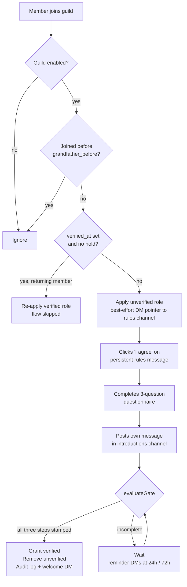

# Onboarding Verification Gate — Design

## Revision History

- **2026-08-08** — Initial design. Single guild, configuration via environment variables.
- **2026-08-10** — Reworked for **multi-guild use**. All per-server settings moved from environment variables into a database table configured at runtime through `/config` slash commands. Onboarding tables re-keyed on `(guild_id, user_id)`. Added the **enable gate** and **grandfathering**, which together prevent the bot from mass-restricting an established server's existing members. Also folded in fixes from the pre-development plan review (see Known Failure Modes Designed Out).
- **2026-08-10 (later)** — Added the **Scale & Concurrency Model** section below, plus plan 05. Establishes process sharding, a rate-limit-aware priority queue, config caching, and chunked reconciliation as the scaling strategy — and records why `worker_threads` is explicitly not part of it.

## Goal

A Discord bot any server can add. Once a server admin configures it and switches it on, new members cannot participate until they have completed three steps: accepted that server's rules, answered a three-question intro questionnaire, and posted their own message in the server's introductions channel. Completing all three automatically grants the configured `verified` role and removes the `unverified` role applied on join.

**Done means:** the bot can be invited to a server it has never seen, an admin can configure it entirely through slash commands without touching a config file or restarting anything, a new member can reach `verified` through Discord UI alone, and moderators can inspect, override, or reset any member's progress.

## Scope

**In scope:** multi-guild support, runtime configuration via slash commands, the full gate flow, its persistence, moderator tooling, reminder DMs, startup reconciliation, and the documentation needed to run the bot locally.

**Out of scope:** production hosting, deployment pipelines, process supervision, log shipping, and a web dashboard.

Sharding **is** in scope as of the second 2026-08-10 revision — see the Scale & Concurrency Model below and plan 05.

## Global Constraints

- Runtime: Node.js 20+, ESM only, `node:` prefix on builtin imports
- Language: TypeScript, strict mode, `moduleResolution: nodenext`
- Library: discord.js v14
- Storage: SQLite via `better-sqlite3`
- Tests: Vitest
- Formatting: tabs, width 2, single quotes, no semicolons (project Prettier config)
- Package manager: pnpm
- No web UI. All interaction — member _and_ administrative — happens through native Discord components.
- Gateway intents: `Guilds`, `GuildMembers`, `GuildMessages`. **Not** `MessageContent`.
- **The bot never kicks or bans anyone.** No feature may add that capability.

## Configuration Model

Only two environment variables remain, because neither is server-specific:

| Variable        | Purpose                                                                                                    |
| --------------- | ---------------------------------------------------------------------------------------------------------- |
| `DISCORD_TOKEN` | Bot token                                                                                                  |
| `DATABASE_PATH` | SQLite file location (defaults to `./data/onboarding.db`)                                                  |
| `DEV_GUILD_ID`  | _Optional._ When set, commands also register to this one guild for instant availability during development |

Everything else is per-guild and lives in the `guild_config` table, set through `/config`. A guild the bot has never been configured for is inert: it receives events and ignores them.

### The enable gate

`guild_config.enabled` starts at `0`. **While a guild is disabled the bot takes no action in it** — no roles applied, no reminders, no reconciliation. An admin must:

1. Set all five required values (`rules`, `introductions`, and `modlog` channels; `verified` and `unverified` roles)
2. Run `/config enable`, which runs a preflight and refuses if anything is wrong

This exists because the alternative is catastrophic. Reconciliation treats "member has no onboarding record" as "new member, apply `unverified`". Without the gate, adding the bot to an established 10,000-member server would strip access from every existing member in one burst of rate-limited role writes. The enable gate makes activation a deliberate, validated act.

### Grandfathering

`/config enable` stamps `grandfather_before` with the current time. **Any member who joined the server before that instant is exempt** — reconciliation skips them entirely and they are never given `unverified`. The gate applies only to members who join after the admin switched it on.

`/config enable` reports how many existing members were grandfathered, so the admin sees the blast radius as zero. An admin who genuinely wants existing members to onboard can run `/config grandfather clear`, which is deliberately a separate, explicit action.

## The Flow



Steps may complete in any order. A member who posts in the introductions channel before accepting the rules has that step banked; the gate does not open until all three timestamps exist.

## Architecture

Three layers, dependencies pointing inward:

| Layer          | Responsibility                                                        | May import discord.js         |
| -------------- | --------------------------------------------------------------------- | ----------------------------- |
| `src/discord/` | Adapters — event handlers, slash commands, component builders         | Yes — the only layer that may |
| `src/core/`    | Domain — gate evaluation, config resolution, onboarding orchestration | No                            |
| `src/db/`      | Repositories over SQLite. Plain functions, no ORM                     | No                            |

`core/` reaches the outside world through a narrow `DiscordPort`. Because the bot is now multi-guild, **every port method takes a `guildId`**:

```ts
export type DiscordPort = {
	addRole: (guildId: string, userId: string, roleId: string) => Promise<Result<void, RoleError>>
	removeRole: (guildId: string, userId: string, roleId: string) => Promise<Result<void, RoleError>>
	sendDm: (userId: string, content: DmContent) => Promise<Result<void, DmError>>
	postAudit: (
		guildId: string,
		channelId: string,
		entry: AuditEntry
	) => Promise<Result<void, ChannelError>>
}
```

A single port instance is constructed from the `Client` and resolves the guild per call, rather than one port per guild.

## Data Model

```sql
CREATE TABLE IF NOT EXISTS guild_config (
	guild_id                 TEXT PRIMARY KEY,
	rules_channel_id         TEXT,
	introductions_channel_id TEXT,
	mod_log_channel_id       TEXT,
	verified_role_id         TEXT,
	unverified_role_id       TEXT,
	rules_text               TEXT,
	rules_message_id         TEXT,
	enabled                  INTEGER NOT NULL DEFAULT 0,
	grandfather_before       TEXT,
	joined_at                TEXT NOT NULL,
	configured_at            TEXT,
	configured_by            TEXT
);

CREATE TABLE IF NOT EXISTS onboarding (
	guild_id                   TEXT NOT NULL,
	user_id                    TEXT NOT NULL,
	first_joined_at            TEXT NOT NULL,
	last_joined_at             TEXT NOT NULL,
	rules_accepted_at          TEXT,
	questionnaire_completed_at TEXT,
	intro_posted_at            TEXT,
	intro_message_id           TEXT,
	verified_at                TEXT,
	verification_hold_at       TEXT,
	verification_hold_by       TEXT,
	reminders_sent             INTEGER NOT NULL DEFAULT 0,
	last_reminder_at           TEXT,
	PRIMARY KEY (guild_id, user_id)
);

CREATE TABLE IF NOT EXISTS questionnaire_answers (
	guild_id          TEXT NOT NULL,
	user_id           TEXT NOT NULL,
	purpose           TEXT,
	experience_level  TEXT,
	built_for_discord INTEGER,
	answered_at       TEXT,
	PRIMARY KEY (guild_id, user_id),
	FOREIGN KEY (guild_id, user_id) REFERENCES onboarding(guild_id, user_id) ON DELETE CASCADE
);

CREATE INDEX IF NOT EXISTS idx_onboarding_pending
	ON onboarding (guild_id, verified_at, verification_hold_at, reminders_sent, last_joined_at);
```

Timestamps are ISO 8601 UTC strings. Each onboarding step is a nullable timestamp, so the record _is_ the state — there is no separate status column that can drift.

The same member in two different servers has two independent rows. Answers are per-guild too: someone's stated purpose in a game server has no business appearing in a developer server's mod log.

Step writes are idempotent (`SET x = COALESCE(x, ?)`), so a double-clicked button or replayed gateway event is a no-op.

`experience_level` is one of exactly four values, enforced in TypeScript as a const-object union:

```ts
export const EXPERIENCE_LEVELS = {
	NEW: 'new-to-everything',
	SOME: 'a-little-experience',
	WRITES: 'writes-software',
	ADVANCED: 'advanced'
} as const

export type ExperienceLevel = (typeof EXPERIENCE_LEVELS)[keyof typeof EXPERIENCE_LEVELS]
```

The experience answer is **stored only**. No roles are derived from it.

## Config Resolution

`guild_config` columns are nullable because a guild is configured incrementally. The domain must never operate on a half-configured guild, so resolution is a narrowing step:

```ts
export type ResolvedGuildConfig = {
	readonly guildId: string
	readonly rulesChannelId: string
	readonly introductionsChannelId: string
	readonly modLogChannelId: string
	readonly verifiedRoleId: string
	readonly unverifiedRoleId: string
	readonly rulesText: string
	readonly grandfatherBefore: string | null
}

export type ConfigProblem = { readonly field: string; readonly message: string }

export const resolveGuildConfig = (
	row: GuildConfigRow | null
): Result<ResolvedGuildConfig, ConfigProblem[]> => {
	/* ... */
}
```

Every event handler resolves first and returns early on failure. `ResolvedGuildConfig` is the only config type the gate, the service, and the sweep accept — a half-configured guild is unrepresentable past that boundary.

`resolveGuildConfig` checks structural completeness only. Live Discord checks (does the role exist, is it below the bot's own role, can the bot post in the channel) belong to preflight, which needs a gateway connection.

## Slash Commands

All commands register **globally**, so they work in every server the bot joins without per-guild registration. Global propagation can take up to an hour; `DEV_GUILD_ID` registers to one guild instantly for development.

### `/config` — requires **Manage Server**

| Subcommand                                                 | Behaviour                                                                                                                                                               |
| ---------------------------------------------------------- | ----------------------------------------------------------------------------------------------------------------------------------------------------------------------- |
| `/config show`                                             | Ephemeral embed of current settings, which are missing, and enabled state                                                                                               |
| `/config channel <rules\|introductions\|modlog> <channel>` | Sets one channel. Validates the bot can view and send there                                                                                                             |
| `/config role <verified\|unverified> <role>`               | Sets one role. Validates it exists and sits below the bot's top role                                                                                                    |
| `/config rules-text`                                       | Opens a modal for the rules body. Defaults to a sensible starter set if never set                                                                                       |
| `/config enable`                                           | Runs preflight; on success sets `enabled = 1`, stamps `grandfather_before`, publishes the rules message, and reports the grandfathered count                            |
| `/config disable`                                          | Sets `enabled = 0`. Data is retained; the bot simply stops acting in that guild                                                                                         |
| `/config grandfather clear`                                | Clears `grandfather_before` so existing members are also required to onboard. Replies with an explicit confirmation of how many members this newly subjects to the gate |

### `/onboarding` — requires **Manage Roles**

| Subcommand                      | Behaviour                                                                                              |
| ------------------------------- | ------------------------------------------------------------------------------------------------------ |
| `/onboarding status <member>`   | Ephemeral embed: each step with timestamp or "not done", hold state, stored answers                    |
| `/onboarding verify <member>`   | Lifts any hold, stamps outstanding steps, grants `verified`. Audit records the moderator               |
| `/onboarding unverify <member>` | Sets a hold, clears `verified_at`, removes `verified`, applies `unverified`. Steps retained as history |
| `/onboarding reset <member>`    | Deletes the record and answers, re-applies `unverified`                                                |

### `/intro` — any member

Opens or resumes the questionnaire at the first unanswered question.

Every mod command creates the member's record if it does not exist, so a command against a member the bot has never seen behaves correctly instead of silently updating zero rows.

## Component Behaviour

**Rules message.** One bot-authored message with an embed and an `I agree` button lives in the configured rules channel. Its id is stored in `guild_config.rules_message_id`, so republishing edits that exact message rather than scanning channel history. If the stored id no longer resolves — deleted, or the channel changed — the bot posts a fresh one and stores the new id. Because the message is persistent rather than an interaction reply, its button never expires.

**Questionnaire.** Three steps, each a fresh interaction:

1. **Purpose** — a modal with a paragraph text input, 10–1000 characters, required.
2. **Experience** — a string select menu with the four fixed options.
3. **Discord dev history** — Yes / No buttons.

Because these arrive as three separate interactions, partial progress must be durable: a member may answer question 1, close Discord, and return the next day. The `questionnaire_answers` columns are therefore **nullable**, the row is created on the first answer, and `answered_at` plus `questionnaire_completed_at` are stamped in one transaction only when all three are non-null. The completeness rule lives in the repository, so no interaction handler needs to know whether it is the last one.

**Modal-first ordering.** `showModal` must be an interaction's _first_ response — it cannot follow `reply()`. The rules `I agree` handler therefore delegates straight to the questionnaire prompter without replying first; the prompter replies only when the next step is not a modal.

**Intro watcher.** `messageCreate` in the configured introductions channel ignores bots and members who already have `intro_posted_at`. Any other message stamps the step and stores its id. There is no minimum-length check — which is precisely why `MessageContent` is unnecessary. The handler needs only author, channel, and message id, all of which arrive without the privileged intent.

**Custom IDs** are namespaced and parsed through one module, so component routing never depends on string literals scattered across handlers.

## Background Tasks

**Startup reconciliation** runs once after `ready`, per enabled guild, and repairs drift accumulated while the bot was offline.

| Observed state                                       | Action                                           |
| ---------------------------------------------------- | ------------------------------------------------ |
| Joined before `grandfather_before`                   | **Skip entirely**                                |
| No record, not verified                              | Create record, apply `unverified`                |
| `verified_at` set, no hold, missing `verified` role  | Re-apply the role                                |
| Hold set, still has `verified` role                  | Remove `verified`, apply `unverified`            |
| All three steps stamped, `verified_at` null, no hold | Run the gate — grants and audits                 |
| Has `verified` role, no record                       | Leave alone, report to audit channel for a human |

**Reminder sweep** runs hourly across all enabled guilds. A member is DMed when their record has no `verified_at`, no hold, and either `reminders_sent = 0` with ≥24h since `last_joined_at`, or `reminders_sent = 1` with ≥72h. The DM names the outstanding steps. On send, `reminders_sent` increments and `last_reminder_at` is stamped; at `reminders_sent = 2` the member is never contacted again.

The counter increments **even when the DM fails** — otherwise a member with closed DMs is reselected by every future sweep forever.

A member whose steps are all complete but who is somehow unverified would produce an empty reminder; the sweep increments their counter anyway rather than skipping, so no row can be reselected indefinitely. Reconciliation resolves the underlying state on the next boot.

## Rejoin Behaviour

Records are keyed by `(guild_id, user_id)` and survive departures. A returning member whose record has `verified_at` and no hold is re-granted `verified` immediately and skips the flow. A returning member under a hold gets `unverified` and stays there until a moderator lifts it.

**Accepted trade-off:** a member who leaves to escape moderator attention before anyone applies a hold returns verified. Mitigation is procedural — ban rather than kick for cause, since banned users cannot rejoin — with `/onboarding unverify` (whose hold survives departure) and `/onboarding reset` as manual levers.

## Error Handling

`Result<T, E>` for expected failure paths; `throw` reserved for programmer error and invariant violations. Nothing is swallowed silently; every caught error is logged with structured context (`guildId`, `userId`, `step`, `operation`).

| Failure                              | Classification          | Handling                                                            |
| ------------------------------------ | ----------------------- | ------------------------------------------------------------------- |
| Member has DMs closed                | Expected                | Logged at info, flow continues — the rules message is the real path |
| Bot lacks Manage Roles in a guild    | Config error            | Preflight refuses `/config enable` and names it                     |
| `verified` role above bot's top role | Config error            | Same. The most common real-world breakage                           |
| Guild not configured or disabled     | Expected                | Handlers resolve config and return early                            |
| Member left mid-flow                 | Expected                | Record retained, no error                                           |
| Duplicate or replayed event          | Expected                | Idempotent `COALESCE` write makes it a no-op                        |
| Audit channel missing/forbidden      | Expected                | Logged, never blocks a role grant                                   |
| Missing `DISCORD_TOKEN`              | Programmer/config error | Throw at boot                                                       |
| SQLite write failure                 | Unexpected              | Throw, log with context, caught at the handler boundary             |

**Every gateway event handler is wrapped in an error boundary** that catches and logs. An unhandled rejection in an event listener terminates the Node process, which would take the bot down for every server it serves — unacceptable once it is multi-guild.

## Known Failure Modes Designed Out

These were found reviewing the plans before development and are fixed in the design rather than left for implementation to rediscover:

| Failure                                                       | Resolution                                                           |
| ------------------------------------------------------------- | -------------------------------------------------------------------- |
| Mass-restricting an established server's members on first run | Enable gate plus grandfathering                                      |
| `showModal` after `reply()` throwing on the primary path      | Rules handler delegates to the prompter without replying             |
| Unhandled rejection in an event listener killing the process  | Explicit error boundary around every listener                        |
| Questionnaire marked complete with a missing answer           | Completion derived from the answers row, never asserted by a handler |
| Mod commands silently updating zero rows for unknown members  | Commands upsert the record first                                     |
| Reminder rows reselected forever                              | Counter increments regardless of DM outcome                          |
| Test type errors going unnoticed                              | `tests/` included in the typecheck                                   |

## Scale & Concurrency Model

Full rationale in [`decisions/2026-08-10-concurrency-and-scale-model.md`](../../../decisions/2026-08-10-concurrency-and-scale-model.md). Implemented by plan 05.

### What the bottleneck actually is

Per onboarding event, the domain work is trivial — `evaluateGate` is four null checks — while a single Discord REST call is 50–500 ms of network. The workload is essentially 100% I/O.

The ceiling is Discord's rate limits, which are **per bot token, not per thread**: roughly 50 requests/second globally, bucketed per route, with a 10,000-invalid-requests-per-10-minutes ban threshold. Reconciling a 10,000-member guild means 10,000 role calls — twenty to thirty minutes of wall clock regardless of how many threads exist.

### Why not worker threads

Threads cannot expand a rate-limit budget. Extra threads would contend for the same bucket and produce more 429s, while requiring cross-thread limit coordination that discord.js provides free inside one process. `better-sqlite3` is also synchronous and does not take concurrent writers across threads without `SQLITE_BUSY` contention.

**No `worker_threads` in the codebase.** The trigger for revisiting is explicit: sustained event-loop lag attributable to genuine CPU work, visible in the metrics from plan 05 task 6. Nothing in the current feature set qualifies.

### The five axes that do scale it

| Axis                    | Mechanism                                                                                                                                                                                                |
| ----------------------- | -------------------------------------------------------------------------------------------------------------------------------------------------------------------------------------------------------- |
| **Process sharding**    | `ShardingManager` spawns one process per shard, each owning a disjoint guild subset with its own event loop and heap. Discord mandates this past 2,500 guilds                                            |
| **Priority queue**      | Every Discord write passes through one queue with bounded concurrency. Interactive work (a button click) always outranks bulk work (reconciliation, sweeps), so a backfill never starves live onboarding |
| **Config cache**        | Guild config is read on every gateway event; cached in memory it is a `Map` lookup instead of a SQLite query per message. Invalidated on write, per guild                                                |
| **Prepared statements** | Every SQL statement compiles once at repository construction rather than per call                                                                                                                        |
| **Bounded caches**      | discord.js message, presence and reaction caches disabled; members and users swept on an interval. Default caching is the dominant memory cost for a bot in many guilds                                  |

### Database at scale

Onboarding events are rare per member — a handful across their entire membership. Even 1,000 active guilds at 100 joins/day is roughly one write per second, which SQLite absorbs without noticing. Shards share one file in WAL mode with `synchronous = NORMAL` and a 5-second busy timeout.

The limit is documented rather than discovered: if write contention ever appears in the lag metric, the repository interface is the swap point for Postgres and nothing above it changes.

### Grandfathering is also a performance decision

Adopted for safety, it removes the single largest bulk workload the bot could ever face — backfilling an established community — from the critical path entirely.

## Testing Strategy

One test per behaviour, Arrange/Act/Assert, descriptive sentence names, real dependencies at boundaries, no logic in tests, injected clock wherever elapsed time matters.

| Target               | Approach                                                                                                                                       |
| -------------------- | ---------------------------------------------------------------------------------------------------------------------------------------------- |
| `evaluateGate`       | Table-driven over every step combination crossed with verified/held, including that a held member with all steps returns `held`, never `grant` |
| `resolveGuildConfig` | Every missing-field permutation reports that field by name; a complete row resolves                                                            |
| Repositories         | Real in-memory SQLite, including guild isolation — the same user id in two guilds must not collide                                             |
| `onboarding-service` | Fake `DiscordPort`, asserting emitted effects rather than internals                                                                            |
| Reconciliation       | Seeded states covering each drift row, plus grandfathered members being skipped                                                                |
| Reminder sweep       | Injected clock; who is DMed at 24h/72h, that the cap holds, and that guilds are handled independently                                          |
| Config commands      | Enable refuses on incomplete config and names every missing field                                                                              |

No test touches the live Discord API.

## Documentation Deliverable

`README.md` covering: what the bot does; prerequisites; creating the Discord application; **enabling the Server Members privileged intent**, without which the bot never sees joins; the invite URL with `bot` + `applications.commands` scopes and Manage Roles / Send Messages / Read Message History / Embed Links; the role hierarchy requirement; the two environment variables; the `/config` walkthrough an admin follows after inviting the bot; what enable/grandfathering does and why; and `pnpm dev` / `pnpm test` / `pnpm build`.

## Open Questions

None. All questions raised during brainstorming and the pre-development review are resolved above.
